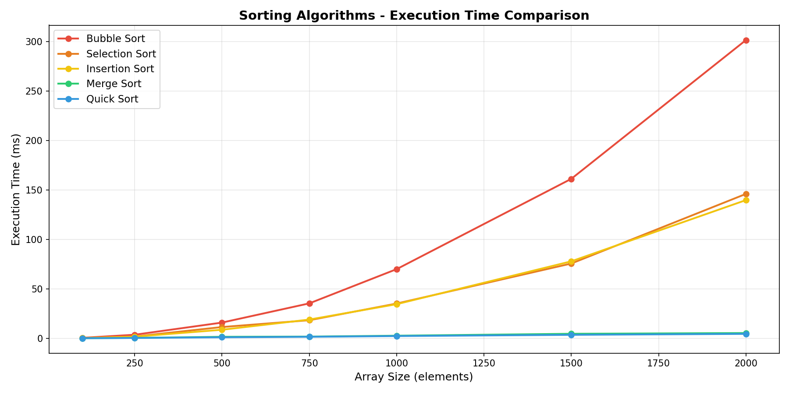
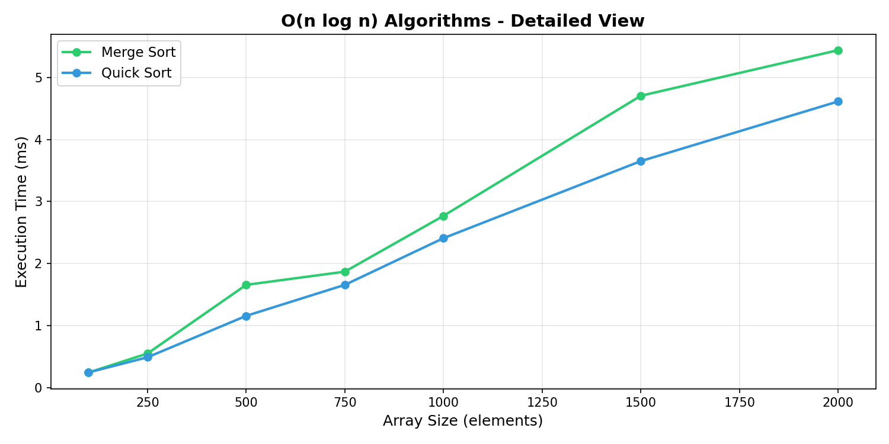

# Sorting Algorithms Visualizer

A Jupyter Notebook that implements 5 classic sorting algorithms from scratch 
in Python and compares their performance using random arrays of increasing sizes.
Built to practice data structures, algorithmic thinking, and data visualization.

## Algorithms Implemented

- Bubble Sort — O(n²)
- Selection Sort — O(n²)
- Insertion Sort — O(n²)
- Merge Sort — O(n log n)
- Quick Sort — O(n log n)

## Key Features

- Each algorithm implemented from scratch without built-in sort functions
- Performance benchmark on arrays from 100 to 2000 elements
- Comparative line chart showing execution time growth per algorithm
- Complexity summary table (best, average and worst case)

## Requirements

- Python 3.10+
- numpy
- matplotlib
- pandas
- jupyter

## Results

### Execution Time Comparison

### O(n log n) Algorithms — Detailed View

